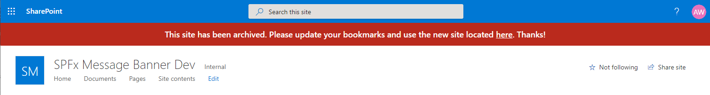
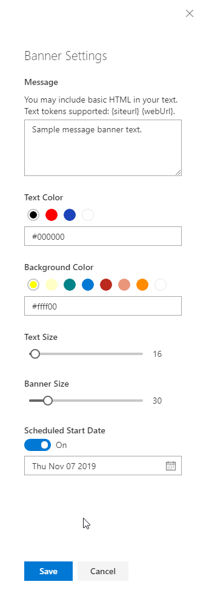

## Custom Message Banner for Modern SharePoint Sites

Add a custom banner message to your SharePoint Online modern sites. Allows a site owner to modify the text, font size, colors and height of the banner. Specify a start date to control when the banner is visible to members of a site. Experimental support for setting the custom action host property 'preAllocatedApplicationCustomizerTopHeight' to avoid the page shifting upon load.

Built using a SharePoint Framework Application Customizer Extension with the Top placeholder. Customization settings are saved into the ClientSideComponentProperties of the host custom action. Supports adding at the site-scope or web-scope.

### Screenshots



<!--  -->

## Setup Instructions
### Pre-requisites
- App Catalog: Ensure the [App Catalog](https://docs.microsoft.com/en-us/sharepoint/use-app-catalog) is setup in your SharePoint Online tenant
- PnP PowerShell or Office 365 CLI: Ensure you have the latest version of the [SharePointPnPPowerShellOnline](https://docs.microsoft.com/en-us/powershell/sharepoint/sharepoint-pnp/sharepoint-pnp-cmdlets?view=sharepoint-ps) module installed. Alternatively, you can use the [Office 365 CLI](https://pnp.github.io/office365-cli/).

### Installation
1. Download the SPFx package [message-banner.sppkg](https://github.com/bschlintz/spfx-message-banner/blob/master/sharepoint/solution/message-banner.sppkg) file from Github (or clone the repo and build the package yourself)
2. Upload sppkg file to the 'Apps for SharePoint' library in your Tenant App Catalog
3. Click the 'Make this solution available to all sites in your organization' checkbox and then click Deploy
4. Register the SPFx extension on your target SharePoint site(s) using one of the methods below.
   #### PnP PowerShell
   ```powershell
   Connect-PnPOnline -Url "https://tenant.sharepoint.com/sites/target"
   
   #Site Collection Scoped
   Add-PnPCustomAction -Title "CustomMessageBanner" -Name "CustomMessageBanner" -Location "ClientSideExtension.ApplicationCustomizer" -ClientSideComponentId "1e2688c4-99d8-4897-8871-a9c151ccfc87" -ClientSideComponentProperties "{`"message`":`"Sample site-scoped message banner text.`"}" -Scope Site

   #Web Scoped
   Add-PnPCustomAction -Title "CustomMessageBanner" -Name "CustomMessageBanner" -Location "ClientSideExtension.ApplicationCustomizer" -ClientSideComponentId "1e2688c4-99d8-4897-8871-a9c151ccfc87" -ClientSideComponentProperties "{`"message`":`"Sample web-scoped message banner text.`"}" -Scope Site
   ```

   #### Office 365 CLI
   ```bash
   o365 spo login https://tenant.sharepoint.com/sites/target
   
   #Site Collection Scoped
   o365 spo customaction add --url 'https://tenant.sharepoint.com/sites/target' --title 'CustomMessageBanner' --name 'CustomMessageBanner'--location 'ClientSideExtension.ApplicationCustomizer' --clientSideComponentId '1e2688c4-99d8-4897-8871-a9c151ccfc87' --clientSideComponentProperties '{\"message\":\"Sample site-scoped message banner text.\"}' --scope Site

   #Web Scoped
   o365 spo customaction add --url 'https://tenant.sharepoint.com/sites/target' --title 'CustomMessageBanner' --name 'CustomMessageBanner'--location 'ClientSideExtension.ApplicationCustomizer' --clientSideComponentId '1e2688c4-99d8-4897-8871-a9c151ccfc87' --clientSideComponentProperties '{\"message\":\"Sample web-scoped message banner text.\"}' --scope Web
   ```

### Updates
Follow the same steps as installation. Overwrite the existing package in the 'Apps for SharePoint' library when uploading the new package. 

> __Tip #1__: Be sure to check-in the sppkg file after the deployment if it is left checked-out.

## Configuration
This solution is deployed by registering a custom action on your site(s) at either the site or web scopes. 

The banner settings are saved into the ClientSideComponentProperties on the custom action. The specific properties are below which can be set programmatically using one of the installation methods described above.

| Property Name       | Default Value | Description |
| ------------------- | ------------- | ----- |
| message | `"This is a sample banner message. Click the edit icon on the right side to update the banner settings."` | Text or HTML. Supports {siteurl} and {weburl} tokens. |
| textColor | `"#333333"` | Text color shown within the banner. |
| backgroundColor | `"#ffffc6"` | Background color of the banner. |
| textFontSizePx | `14` | Font size of the banner text in pixels. |
| bannerHeightPx | `30` | Height of the banner in pixels. |
| visibleStartDate | `null`  | Optional. Date string at which the banner message should be shown to members and visitors of the site. Message will always be visible to admins.

Additionally, if you are a site owner or site collection adminstrator, you can customize the banner using the 'edit' pencil icon via the browser.



## Disclaimer

Microsoft provides programming examples for illustration only, without warranty either expressed or implied, including, but not limited to, the implied warranties of merchantability and/or fitness for a particular purpose. We grant You a nonexclusive, royalty-free right to use and modify the Sample Code and to reproduce and distribute the object code form of the Sample Code, provided that You agree: (i) to not use Our name, logo, or trademarks to market Your software product in which the Sample Code is embedded; (ii) to include a valid copyright notice on Your software product in which the Sample Code is embedded; and (iii) to indemnify, hold harmless, and defend Us and Our suppliers from and against any claims or lawsuits, including attorneys' fees, that arise or result from the use or distribution of the Sample Code.
